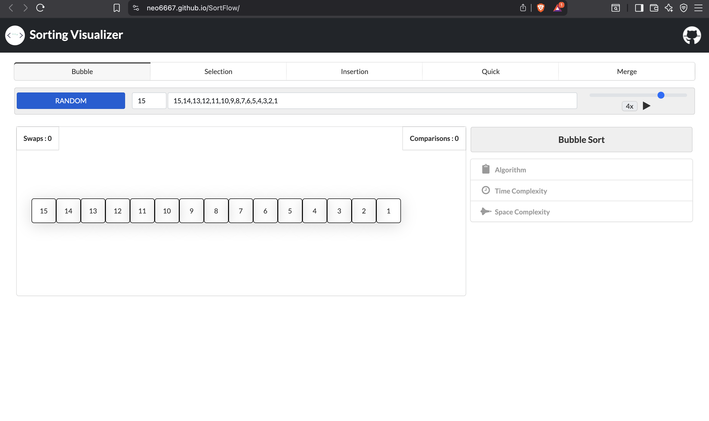

# 🧠 Sorting Visualizer

A dynamic web-based visualization tool to demonstrate how popular sorting algorithms work — built with ❤️ using HTML, CSS, and JavaScript.


---

## ✨ Features

- 🎞️ Real-time visualization of sorting steps
- 🔢 Supports multiple algorithms:
  - Bubble Sort
  - Selection Sort
  - Insertion Sort
  - Merge Sort
  - Quick Sort
- 🎚 Adjustable array size and speed
- 🎨 Intuitive UI with responsive design
- 💻 Works on all modern browsers

---

## 🚀 Live Demo

👉 [Click here to try it out!](https://neo6667.github.io/SortFlow/)

---

## 🛠 Tech Stack

- **Frontend**: HTML, CSS, JavaScript
- **Deployment**: GitHub Pages

---

## 📷 Screenshots

| Desktop | Mobile |
|--------|--------|
|  |  |

---

## 📦 How to Run Locally

```bash
# Clone the repository
git clone https://github.com/NEO6667/SortFlow.git

# Navigate into the directory
cd SortFlow

# Open index.html in your browser
